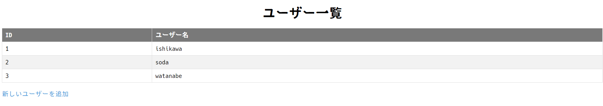
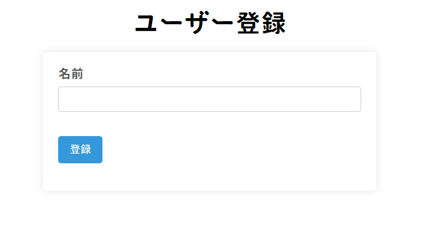
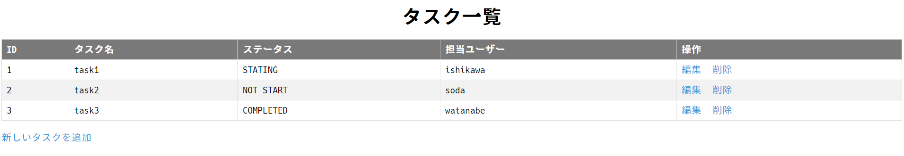
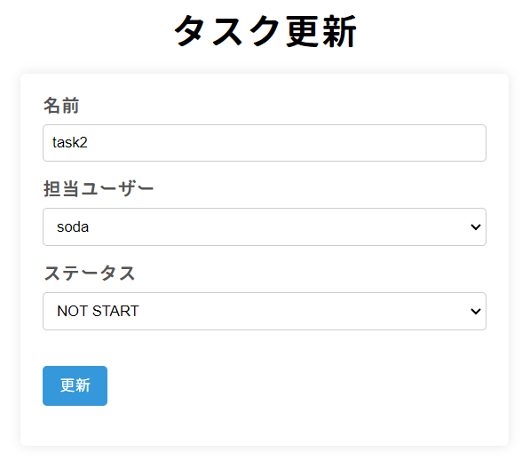
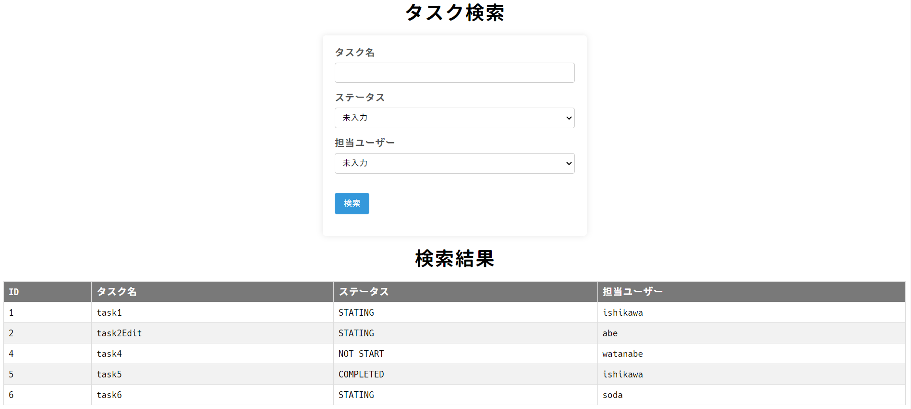
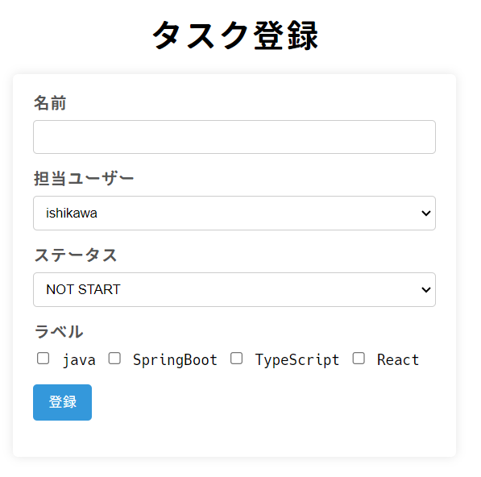

# 進捗確認試験

## 試験を始める前に必ずやること!!

以下の手順に沿って操作を行ってください。

1. VSCodeで、プロジェクト直下にある`.github`フォルダの中の `/workflows/classroom.yml`というファイルを開く
2. 1で開いたファイルの中身を以下の内容に丸ごと書き換える
    1. ミスしないように必ず**コピペ**で書き換えること

```yaml
name: GitHub Classroom Workflow

on:
  - push
  - workflow_dispatch

permissions:
  checks: write
  actions: read
  contents: read

jobs:
  build:
    name: Autograding
    runs-on: ubuntu-latest
    if: github.actor != 'github-classroom[bot]'
    steps:
      - uses: actions/checkout@v4
      - uses: actions/setup-java@v4
        with:
          distribution: 'temurin'
          java-version: '21'
      - uses: education/autograding@v1
```

1. 書き換えが完了したらこのファイルを閉じる
    1. 以降このファイルは絶対に操作しないこと（何か誤操作があるとソースコードが動かなくなります）

## 試験概要

DBと連携したタスク管理アプリケーションを実装します。

以下の説明を読み、各設問に解答し提出してください。

- DBと連携するための `application.properties`や `build.gradle`は既に準備されているので、そこは編集しないこと
- 解答に必要なクラスは既に用意しているため、そこにソースコードを実装していくこと
- 各設問に必要なHTMLファイルは既に用意しているので、HTMLファイルの内容からも予測して実装すること
- 実装完了後、自己採点（動作確認）を行うこと
- 自己採点完了後、次の設問をすすめること
- 全てのプログラムが実行可能であること
- コンパイルエラー状態での提出は禁止
- 出力内容やメソッド名が指示通りでない場合は不正解となる
- 実行時に`Build failed, do you want to continue.`という警告が出たときは`continue`を選択すると実行可能

## 事前準備

1. 試験用のプロジェクトをクローンした後に、以下情報のDBを作成しなさい。

```java
ユーザー名：chapter2_test_user
パスワード：password
DB名：chapter2_test_db
```

2. DBが作成できたらプロジェクトを実行し、以下テーブルが作成されているか確認してください。
- users
- tasks
- status
- labels

3. テーブルが作成できたら、以下SQLを実行して初期データを挿入してください。

```sql
INSERT INTO
  users (name)
VALUES
  ('ishikawa'),
  ('soda'),
  ('watanabe')
;

INSERT INTO
  status (name)
VALUES
  ('NOT START'), -- 意味：未着手
  ('STATING'), -- 意味：着手中
  ('COMPLETED') -- 意味：完了
;

INSERT INTO
  labels (name)
VALUES
  ('java'),
  ('SpringBoot'),
  ('TypeScript'),
  ('React')
;
```

## 設問1

### 目安時間

10分

### 問題内容

以下仕様でユーザー一覧機能を実装していきます。

**UserController**

| 項目 | 概要 |
| --- | --- |
| URL | GET通信の `/users` |
| 処理内容 | usersテーブルの一覧データを`users/list.html`に表示する |

**UserService**

| 項目 | 概要 |
| --- | --- |
| メソッド名 | findAllUsers |
| 引数 | なし |
| 処理内容 | usersテーブルの全データを返却する |

**UserRepository**

`users` テーブルを操作できるように修正する

### 動作確認

- URL `http://localhost:8080/users`でアクセスし、以下のようにusers/list.html表示されることを確認する。



- ユーザー一覧画面内に、usersテーブルの全データが表示されていることを確認する


## 設問2

### 目安時間

10分

### 問題内容

この問題は2つの工程に分けて、ユーザー新規登録機能を実装していきます。

1.  以下仕様で、ユーザー新規登録画面を表示する機能を実装しなさい。

    **UserController**

    | 項目 | 概要 |
    | --- | --- |
    | URL | GET通信の `/users/add` |
    | 処理内容 | `users/add.html`を表示する |
2. 以下仕様で、ユーザー新規登録機能を実装しなさい。

    **UserController**

    | 項目 | 概要 |
    | --- | --- |
    | URL | POST通信の `/users/add` |
    | 処理内容 | 1. usersテーブルに入力された値を追加する<br>2. `/users`にリダイレクトする |

    **UserService**

    | 項目 | 概要 |
    | --- | --- |
    | メソッド名 | saveUser |
    | 引数 | Userオブジェクト |
    | 処理内容 | 1. 引数で渡された値をusersテーブルに追加する。<br>2. 登録したオブジェクトを返却する |

### 動作確認

- URL `http://localhost:8080/users/add`でアクセスし、以下のようにusers/add.htmlが表示されることを確認する。

    

- 名前フォームに「abe」と入力し、登録ボタンをクリックした後、ユーザー一覧画面にリダイレクトすることを確認する
- ユーザー一覧画面に入力したデータ「abe」が表示されていることを確認する
- `users`テーブルに以下データが登録されていることを確認する

    ```
    id：4
    name：abe
    ```


## 設問3

### 目安時間

30分

### 問題内容

この問題は2つの工程に分けて、タスク一覧機能を実装していきます。

1. 以下の仕様で、各テーブル同士がリレーションできるように各Entityを修正しなさい。

    **usersとtasks**

    | 項目 | 概要 |
    | --- | --- |
    | users | 1 |
    | tasks | 多 |
    | 外部キー | user_id |
    | Task側のフィールド名 | user |

    **statusとtasks**

    | 項目 | 概要 |
    | --- | --- |
    | status | 1 |
    | tasks | 多 |
    | 外部キー | status_id |
    | Task側のフィールド名 | status |

    Entityを修正したらプロジェクトを実行して、 `tasks`テーブルの構成が変わることを確認し、以下SQLを実行して、動作確認用のデータを挿入してください。

    ```sql
    INSERT INTO
      tasks (name, status_id, user_id)
    VALUES
      ('task1', 2, 1),
      ('task2', 1, 2),
      ('task3', 3, 3)
    ;
    ```

2. 以下の仕様で、タスク一覧機能を実装しなさい。

    **TaskControlller**

    | 項目 | 概要 |
    | --- | --- |
    | URL | GET通信の `/tasks` |
    | 処理内容 | tasksテーブルの一覧データを`tasks/list.html`に表示する |

    **TaskService**

    | 項目 | 概要 |
    | --- | --- |
    | メソッド名 | findAllTasks |
    | 引数 | なし |
    | 処理内容 | tasksテーブルの全データを返却する |

    **TaskRepository**

    `tasks` テーブルを操作できるように修正する


### 動作確認

- URL `http://localhost:8080/tasks`でアクセスし、以下のようにtasks/list.htmlが表示されることを確認する。

    

- 画面内にtasksテーブルの一覧データと、各タスクに紐づくステータスとユーザー名が表示されていることを確認する


## 設問4

### 目安時間

30分

### 問題内容

この問題は2つの工程に分けて、タスク更新機能を実装していきます。

1. 以下仕様で、タスク更新画面を表示する機能を実装しなさい。

    **TaskController**

    | 項目 | 概要 |
    | --- | --- |
    | URL | GET通信の `/tasks/edit/{id}` |
    | 処理内容 | 1. idで該当タスクを取得する<br>2. usersテーブルから一覧データを取得する<br>3. statusテーブルから一覧データを取得する<br>4. `tasks/edit.html`を表示する |

    **TaskService**

    | 項目 | 概要 |
    | --- | --- |
    | メソッド名 | findTaskById |
    | 引数 | 該当タスクのid |
    | 処理内容 | 1. tasksテーブルから該当データを取得する。<br>2. 該当タスクが見つからない場合は、`EntityNotFoundException`をスローする（メッセージは `Task not found with id: {id}`とする ）<br>3. 該当タスクを返却する |

    **StatusService**

    | 項目 | 概要 |
    | --- | --- |
    | メソッド名 | findAllStatus |
    | 引数 | なし |
    | 処理内容 | statusテーブルの全データを返却する |

    **StatusRepository**

    `status`テーブルを操作できるように修正する

2. 以下仕様で、タスク更新機能を実装しなさい。

    **TaskController**

    | 項目 | 概要 |
    | --- | --- |
    | URL | POST通信の `/tasks/edit` |
    | 処理内容 | 1. 入力された値でtasksテーブルのデータを更新する<br>2. `/tasks`にリダイレクトする |

    **TaskService**

    | 項目 | 概要 |
    | --- | --- |
    | メソッド名 | updateTask |
    | 引数 | Taskオブジェクト |
    | 処理内容 | 1. 引数で渡された値でtasksテーブルのデータを更新する。<br>2. 更新したオブジェクトを返却する |

### 動作確認

- URL `http://localhost:8080/tasks/edit/500`でアクセスし、`EntityNotFoundException`がスローされることを確認する
    - ログが`Task not found with id: {id}`であることを確認する
- タスク一覧画面内のID2の編集ボタンをクリックすると、以下のようにtasks/edit.htmlが表示されることを確認する

    

- 「名前」の項目に「task2」という値が初期値として入力されていることを確認する
- 「担当ユーザー」の項目で「soda」が初期値として選択されていることを確認する
- 「ステータス」の項目で「NOT START」が初期値として選択されていることを確認する
- 「担当ユーザー」の項目にusersテーブルの全データ、「ステータス」の項目にstatusテーブルの全データが表示されていることを確認する
- 以下の値を入力・選択後に更新ボタンをクリックし、一覧画面にリダイレクトすることを確認する

    ```java
    名前：task2Edit
    担当ユーザー：abe
    ステータス：STARTING
    ```

- 一覧画面内のID2のデータが、入力された値で上書きされていることを確認する
- `tasks`テーブルのID2のデータが、以下のように更新されていることを確認する

    ```
    name：task2Edit
    status_id：3
    user_id：3
    ```


## 設問5

### 目安時間

20分

### 問題内容

この問題は2つの工程に分けて、タスク削除機能を実装していきます。

1. 以下仕様でタスクが論理削除できるようにしなさい。


    | 項目 | 概要 |
    | --- | --- |
    | カラム名 | is_deleted |
    | 初期値 | false |
    | フィールド名 | isDeleted |

    ※`is_deleted`カラムが追加されたことを確認したら、各データに `false`を入れておく

2. 以下の仕様で、タスクを削除する機能を実装してください。

    **TaskController**

    | 項目 | 概要 |
    | --- | --- |
    | URL | GET通信の `/tasks/delete/{id}` |
    | 処理内容 | 1. idで該当タスクを取得する<br>2. タスクを削除する<br>3. `/tasks`にリダイレクトする |

    **TaskService**

    | 項目 | 概要 |
    | --- | --- |
    | メソッド名 | deleteTask |
    | 引数 | Taskオブジェクト |
    | 処理内容 | 1. タスクを論理削除する<br>2. 削除したオブジェクトを返却する |

### 動作確認

- URL `http://localhost:8080/tasks/delete/500`でアクセスし、`EntityNotFoundException`がスローされることを確認する
- タスク一覧画面内のID3の削除ボタンをクリックすると、タスク一覧画面にリダイレクトされることを確認する
- タスク一覧画面からID3のデータが削除されていることを確認する
- `tasks`テーブルのid3のデータの「is_deleted」が「true」に上書きされていることを確認する


## 設問6

### 目安時間

30分

### 問題内容

以下仕様で`tasks` テーブルの該当データを検索する機能を実装しなさい 。

**TaskController**

| 項目 | 概要 |
| --- | --- |
| URL | GET通信の `/tasks/search` |
| クエリパラメーター | 以下は必須ではなく、初期値は不要なものとする<br>- タスク名（name）<br>- ステータスID（statusId）<br>- 担当ユーザーID（userId） |
| 処理内容 | 1. 入力されたクエリパラメータで、tasksテーブルからデータを取得する<br>2. usersテーブルから一覧データを取得する<br>3. statusテーブルから一覧データを取得する<br>4. `tasks/search.html`を表示する |

**TaskService**

| 項目 | 概要 |
| --- | --- |
| メソッド名 | findTaskByParams |
| 引数 | - 引数1：タスク名<br>- 引数2：ステータスID<br>- 引数3：担当ユーザーID |
| 処理内容 | 1. 引数の値が全てnullなら、tasksテーブルから全データを取得し返却する<br>2. 引数の値でtasksテーブルからデータを取得し、返却する |

**TaskRepository**

| 項目 | 概要 |
| --- | --- |
| メソッド名 | findByParams |
| 引数 | - 引数1：タスク名<br>- 引数2：ステータスID<br>- 引数3：担当ユーザーID |
| 処理内容 | nameカラムと引数1の値が完全一致するデータ、<br>またはstatus_idカラムと引数2の値が完全一致するデータ、<br>またはuser_idカラムと引数3の値が完全一致するデータを<br>tasksテーブルから取得する |

### 動作確認

以下のデータを追加でINSERTしてから、動作確認してください。

```sql
INSERT INTO
  tasks (name, status_id, user_id, is_deleted)
VALUES
  ('task4', 1, 3, false),
  ('task5', 3, 1, false),
  ('task6', 2, 2, false)
;
```

- URL `http://localhost:8080/tasks/search`でアクセスし、以下のようにtasks/search.htmlが表示されることを確認する

    

- 「担当ユーザー」の項目にusersテーブルの全データ、「ステータス」の項目にstatusテーブルの全データが表示されていることを確認する
- タスク名に「java」を入力して検索すると、ID「1」のデータが表示される
- ステータス「STARTING」を選択して検索すると、ID「1」「2」「6」のデータが表示される
- 担当ユーザー「soda」を選択して検索すると、ID「6」のデータが表示される
- タスク名「java」、ステータス「NOT START」を選択して検索すると、ID「1」「4」のデータが表示される
- タスク名「java」、担当ユーザー「abe」を選択して検索すると、ID「1」「2」のデータが表示される
- ステータス「NOT START」、担当ユーザー「ishikawa」を選択して検索すると、ID「1」「4」「5」のデータが表示される
- タスク名「java」、ステータス「NOT START」、担当ユーザー「soda」を選択して検索すると、ID「1」「4」「6」のデータが表示される


## 設問7

### 目安時間

30分

### 問題内容

この問題は3つの工程に分けて、タスク新規登録機能を実装していきます。

1. 以下の仕様で、Task.javaとLabel.javaが多対多でリレーションできるように修正しなさい。

    ※Task側のフィールド名はlabelsとすることとし、Set型とする。
    ※修正できたら、再実行して以下仕様通りのテーブルが作成されているかを確認すること。

    | 項目 | 概要 |
    | --- | --- |
    | テーブル名 | task_label |
    | カラム1 | task_id |
    | カラム2 | label_id |
2. 以下の仕様で、タスク新規登録画面を表示する機能を実装しなさい。

    **TaskController**

    | 項目 | 概要 |
    | --- | --- |
    | URL | GET通信の `/tasks/add` |
    | 処理内容 | 1. Taskオブジェクトをadd.htmlで使えるようにする<br>1. usersテーブルから一覧データを取得する<br>2. statusテーブルから一覧データを取得する<br>3. labelsテーブルから一覧データを取得する<br>4. `tasks/add.html`を表示する |

    **LableService**

    | 項目 | 概要 |
    | --- | --- |
    | メソッド名 | findAllLabels |
    | 引数 | なし |
    | 処理内容 | labelsテーブルの全データを返却する |

    **LabelRepository**

    `labels`テーブルを操作できるように修正する

3. 以下の仕様で、タスクを新規登録する機能を実装してください。

    **TaskController**

    | 項目 | 概要 |
    | --- | --- |
    | URL | POST通信の `/tasks/add` |
    | 処理内容 | 1. tasksテーブルに入力された値を追加する<br>2. `/tasks`にリダイレクトする |

    **TaskService**

    | 項目 | 概要 |
    | --- | --- |
    | メソッド名 | addTask |
    | 引数 | Taskオブジェクト, Labelのコレクション（Set） |
    | 処理内容 | 1. 引数で渡された値をtasks・task_labelテーブルに追加する。<br>2. 登録したオブジェクトを返却する<br>※複数のテーブルを扱うためトランザクションを用いること。 |

### 動作確認

- URL `http://localhost:8080/tasks/add`でアクセスし、以下のようにtasks/add.htmlが表示されることを確認する

    

- 「担当ユーザー」の項目にusersテーブルの全データ、「ステータス」の項目にstatusテーブルの全データ、「ラベル」の項目にlabelsテーブルの全データが表示されていることを確認する
- 以下の値を入力・選択後に登録ボタンをクリックし、一覧画面にリダイレクトすることを確認する

    ```
    名前：task7
    担当ユーザー：soda
    ステータス：NOT START
    ラベル：java・SpringBoot
    ```

- 一覧画面に先ほど入力したデータが追加されていることを確認する
- tasksテーブルに以下データが登録されていることを確認する

    ```
    id：7
    name：task7
    status_id：1
    user_id：2
    is_deleted：false
    ```

- task_labelテーブルに以下データが登録されていることを確認する

    ```
    task_id：7
    label_id：1

    task_id：7
    label_id：2
    ```
