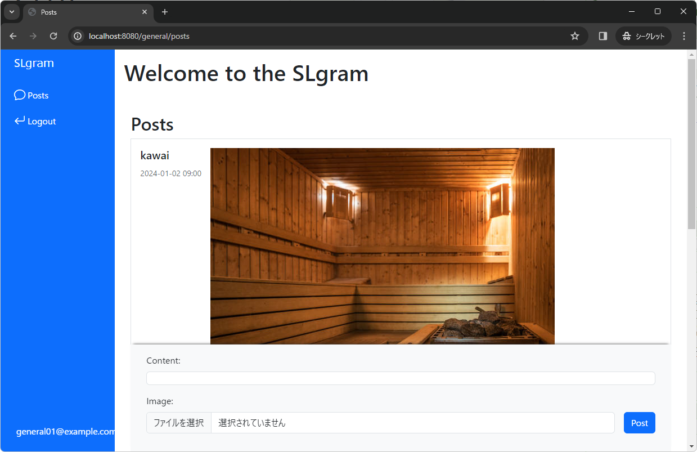
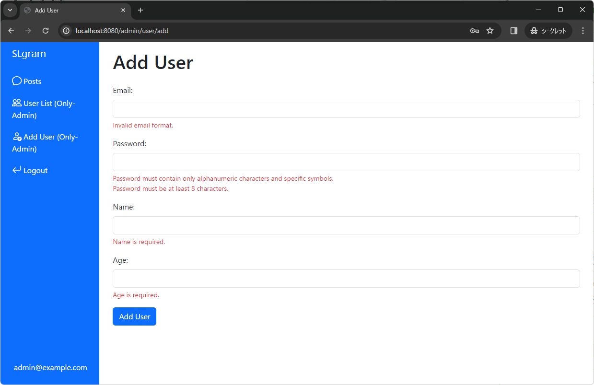
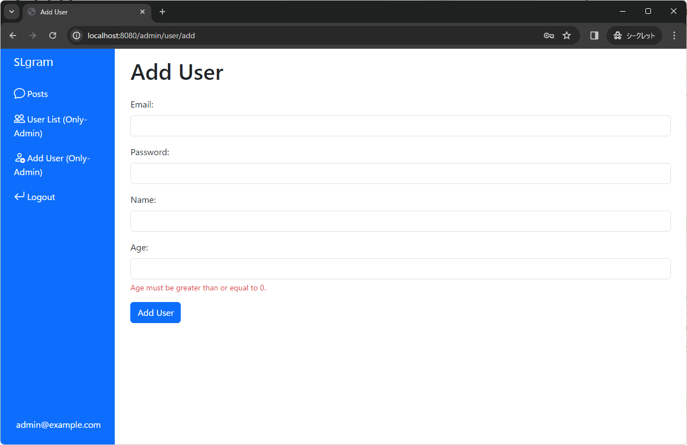
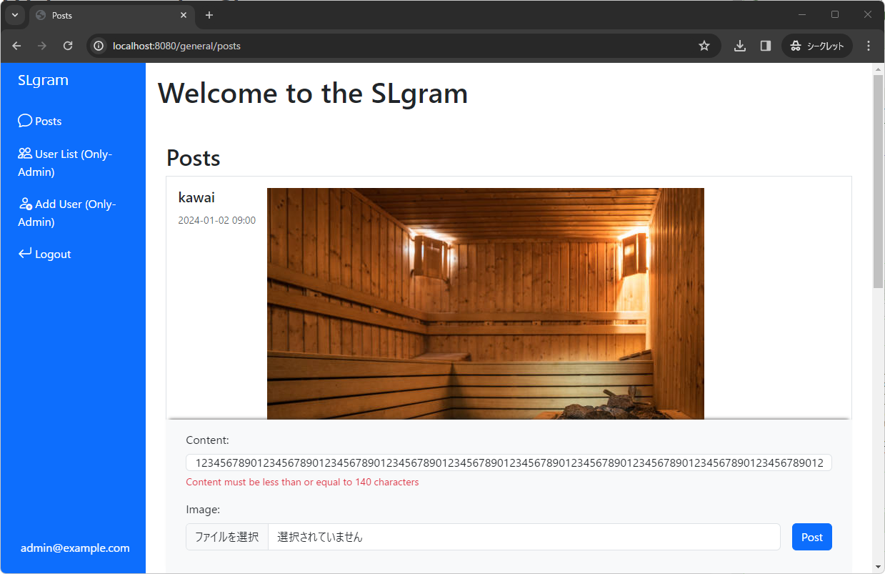
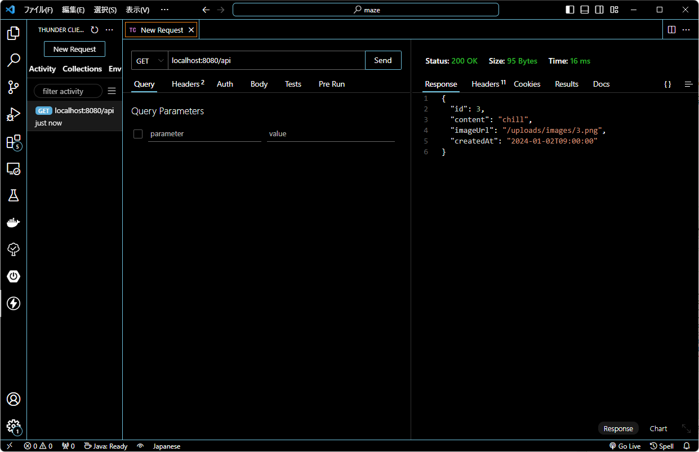

# 進捗確認試験

## 試験を始める前に必ずやること!!

以下の手順に沿って操作を行ってください。

1. VSCodeで、プロジェクト直下にある`.github`フォルダの中の `/workflows/classroom.yml`というファイルを開く
2. 1で開いたファイルの中身を以下の内容に丸ごと書き換える
    1. ミスしないように必ず**コピペ**で書き換えること

```yaml
name: GitHub Classroom Workflow

on:
  - push
  - workflow_dispatch

permissions:
  checks: write
  actions: read
  contents: read

jobs:
  build:
    name: Autograding
    runs-on: ubuntu-latest
    if: github.actor != 'github-classroom[bot]'
    steps:
      - uses: actions/checkout@v4
      - uses: actions/setup-java@v4
        with:
          distribution: 'temurin'
          java-version: '21'
      - uses: education/autograding@v1
```

1. 書き換えが完了したらこのファイルを閉じる
    1. 以降このファイルは絶対に操作しないこと（何か誤操作があるとソースコードが動かなくなります）

## 試験概要

DBと連携したタスク管理アプリケーションを実装します。

以下の説明を読み、各設問に解答し提出してください。

- DBと連携するための `application.properties`や `build.gradle`は既に準備されているので、そこは編集しないこと
- 解答に必要なクラスは既に用意しているため、そこにソースコードを実装していくこと
- 各設問に必要なHTMLファイルは既に用意しているので、HTMLファイルの内容からも予測して実装すること
- 実装完了後、自己採点（動作確認）を行うこと
- 自己採点完了後、次の設問をすすめること
- 全てのプログラムが実行可能であること
- コンパイルエラー状態での提出は禁止
- 出力内容やメソッド名が指示通りでない場合は不正解となる
- 実行時に`Build failed, do you want to continue.`という警告が出たときは`continue`を選択すると実行可能
- 今回はバリデーションやログのメッセージを出力する問題が出題されます。メッセージの内容は必ず`コピペ`して書いてください。半角スペース1つ入ってなかったりするだけで、自動採点が失敗します。

## 事前準備

1. 試験用のプロジェクトをクローンした後に、以下情報のDBを作成しなさい。

    ```java
    ユーザー名：chapter3_test_user
    パスワード：password
    DB名：chapter3_test_db
    ```


1. DBが作成できたらプロジェクトを実行し、以下テーブルが作成されているか確認してください。
- users
- posts

1. テーブルが作成できたら、以下SQLを実行して初期データを挿入してください。

    ```sql

    INSERT INTO
    	users (age, email, name, password, role)
    VALUES
    	('11', 'admin@example.com', 'mizuochi', '$2b$12$d1hM7XeWo/fIwmzWM7tGauxkkotG/sULlW92AGHBtVSktW1aKXzNe', 'ROLE_ADMIN'),
    	('22', 'general01@example.com', 'tabei', '$2b$12$d1hM7XeWo/fIwmzWM7tGauxkkotG/sULlW92AGHBtVSktW1aKXzNe', 'ROLE_GENERAL'),
    	('33', 'general02@example.com', 'kawai', '$2b$12$d1hM7XeWo/fIwmzWM7tGauxkkotG/sULlW92AGHBtVSktW1aKXzNe', 'ROLE_GENERAL')
    ;
    	-- passwordはすべて「password」をハッシュ化した値です。

    INSERT INTO
    	posts (content, created_at, image_url, user_id)
     VALUES
    	('Hello World', '2024-01-01 00:00:00', null, '1'),
    	('my new gear', '2024-01-01 15:00:00', '/uploads/images/2.png', '2'),
      ('chill', '2024-01-02 09:00:00', '/uploads/images/3.png', '3')
    ;
    ```

2. このプロジェクト「SLgram」は、投稿の閲覧や会員による画像の投稿が行える簡易的会員制SNSです。
現在は以下の機能が実装されています。
    1. 投稿閲覧機能
    2. 会員一覧表示機能
    3. 会員新規登録機能

    その他の機能を設問を通して実装してください。


## 設問1

### 目安時間

10分

### 問題内容

この会員制SNSにおいて、以下の要件に沿って認証・認可の設定を行います。

- 投稿一覧はログインなしで閲覧することができる。
- 投稿はロールが「GENERAL」、「ADMIN」のユーザが行える。
- 登録ユーザー一覧表示、新規ユーザー追加は「ADMIN」のユーザのみが行える。

以下URLのアクセスにおいて、以下の仕様でロールによる認証・認可を実装してください。

| URL | 制御 |
| --- | --- |
| / | 認証・認可による制御なし |
| /general/post (GET) | 「GENERAL」、「ADMIN」のユーザーがアクセスできる。 |
| /general/post (POST) | 「GENERAL」、「ADMIN」のユーザーがアクセスできる。 |
| /admin/users/ | 「ADMIN」のユーザーのみアクセスできる。 |
| /admin/user/add (GET) | 「ADMIN」のユーザーのみアクセスできる。 |
| /admin/user/add (GET) | 「ADMIN」のユーザーのみアクセスできる。 |

### 動作確認

1. `localhost:8080/` へアクセスし、サイドメニューの「Login」から、

    ```
    Username: admin@example.com
    Pasword : password
    ```

    で認証を行うと、`localhost:8080/general/posts` へ遷移して以下の表示になることを確認してください。

    

    またログイン後は、サイドメニューの「User List」、「Add User」へ遷移ができ、「Add User」から任意のユーザを登録できることを確認してください。

2. `localhost:8080/` へアクセスし、サイドメニューの「Login」から、

    ```
    Username: general01@example.com
    Pasword : password
    ```

    で認証を行うと、`localhost:8080/general/posts` へ遷移して以下の表示になることを確認してください。

    

    またログイン後は、`/admin/users` 、`/admin/user/add`  にアクセスするとステータスコード403となることを確認してください。


## 設問2

### 目安時間

15分

### 問題内容

新規会員の登録時、以下仕様のバリデーションによる入力チェックを行ってください。

| フィールド | バリデーション | メッセージ |
| --- | --- | --- |
| email | 電子メールアドレス形式のみ入力可 | "Invalid email format.” |
| password | 8文字以上かつ半角英数と一部の記号（-、_、.$%/）のみ入力可 | - 8文字未満の場合<br>"Password must be at least 8 characters.”<br>- 半角英数と一部の記号以外の入力があった場合<br>"Password must contain only alphanumeric characters and specific symbols.” |
| name | null、空、空白のみでないことを指定 | "Name is required.” |
| age | nullでない、かつ 0 以上 100以下であることを指定 | - null の場合<br>"Age is required.”<br>- 0 未満の場合<br>"Age must be greater than or equal to 0.”<br>- 101 以上の場合<br>"Age must be less than or equal to 100.” |

### 動作確認

1. `localhost:8080/` へアクセスし、サイドメニューの「Login」から、

    ```
    Username: admin@example.com
    Pasword : password
    ```

    で認証を行い、サイドメニュー「Add User」を押下して会員新規登録画面へ遷移してください。

2. 以下の入力を行った場合に、エラーメッセージが表示されることを確認してください。


    ```
    Email: aaa
    Password: 入力なし
    Name: 入力なし
    Age: 入力なし
    ```

    


```
Age: -1
```



```
Age: 101
```


## 設問3

### 目安時間

45分

### 問題内容

以下仕様に沿って `GeneralController.java` に、ユーザーがテキストコンテンツと画像を含む投稿を追加できる機能を実装してください。

1. 画像が添付されていない場合はpostsテーブルには以下のようにデータを保存して、 `/general/posts`にリダイレクトしてください。


    | id | (自動入力) |
    | --- | --- |
    | content | 投稿のテキストコンテンツ |
    | created_at | (自動入力) |
    | image_url | null |
    | user_id | 投稿時にログインしているユーザーID |


2. 画像が添付された場合、 `「PostのID」.png` というファイル名で `uploads/images` 配下に画像を格納します。
3. 新規投稿追加時は、以下仕様のバリデーションによる入力チェックを行ってください。


    | フィールド | バリデーション | メッセージ |
    | --- | --- | --- |
    | content | null、空、空白のみでないかつ、140文字以下であることを指定 | - null、空、空白のみの場合<br>"Content cannot be blank”<br>- 141文字以上の場合<br>"Content must be less than or equal to 140 characters” |


4. 画像は.png形式で、ファイルサイズは2MB以下である必要があります。
この条件を満たさない場合、独自例外である `InvalidFileException` がスローされます。
5. `InvalidFileException` がスローされた場合はエラーページ( `templates/error/custom-error.html` )へ遷移し、下表の通りにエラーメッセージを出力してください。
エラーハンドリングは `exception/GlobalExceptionHandler.java` に記述してください。


    | 条件 | メッセージ |
    | --- | --- |
    | 画像が .png形式以外の場合 | "Only .png files are allowed.” |
    | ファイルサイズが2MBより大きい場合 | "File size must be less than 2MB.” |

    また、例外発生時は以下フォーマットでログを出力してください。

    ```
    ERROR 197764 --- [nio-8080-exec-6] c.e.c.exception.GlobalExceptionHandler   : Image loading error occurred: (例外のエラーメッセージ)
    ```

6. DBへの登録は以下のメソッドを使用してください。
    1. `PostService#createPost`
    2. `PostService#updatePostImage`
7. DBのpostsテーブルへは以下の表の通りに登録して、`/general/posts`にリダイレクトしてください。


    | id | (自動入力) |
    | --- | --- |
    | content | 投稿のテキストコンテンツ |
    | created_at | (自動入力) |
    | image_url | /uploads/images/「PostのID」.png |
    | user_id | 投稿時にログインしているユーザーID |


**補足**

1. ログインしてるユーザーを取得する時は、以下のようにハンドラメソッドの引数で指定することで取得可能です。

```java
@GetMapping("/huga")
public String huga(@AuthenticationPrincipal CustomUserDetails userDetails) {
    System.out.print(userDetails.getUser().getId()); // ログインしてるユーザーのID
}
```

2. 画像添付されているかどうかを判定する時は、以下のように `isEmpty`メソッドを使用することで判定できます。

```java
MultipartFile image = hugaForm.getImage();
System.out.print(image.isEmpty()); // 添付されていない場合：true、添付されている場合：false
```

### 動作確認

1. 任意のユーザーでログインし、投稿一覧画面の画面下部より以下を入力後、「POST」ボタンを押下すると投稿が表示されていることを確認してください。

    ```
    Content: 任意の140文字以内の文字列
    Image: プロジェクト直下の「sample.png」
    ```

2. 任意のユーザーでログインし、投稿一覧画面の画面下部より以下を入力後、「POST」ボタンを押下すると画像の通りエラーメッセージが表示されることを確認してください。。

    ```
    Content: 123456789012345678901234567890123456789012345678901234567890123456789012345678901234567890123456789012345678901234567890123456789012345678901
    Image: 入力なし
    ```

    

3. 任意のユーザーでログインし、投稿一覧画面の画面下部より以下を入力後、「POST」ボタンをエラーページへ遷移し、ログが出力されることを確認してください。

    ```
    Content: 任意の140文字以内の文字列
    Image: プロジェクト直下の「sample.jpg」
    ```


1. 任意のユーザーでログインし、投稿一覧画面の画面下部より以下を入力後、「POST」ボタンをエラーページへ遷移し、ログが出力されることを確認してください。

    ```
    Content: 任意の140文字以内の文字列
    Image: プロジェクト直下の「sampleLargesize.png」
    ```


## 設問4

### 目安時間

30分

### 問題内容

ユーザーごとの投稿数を1分ごとに集計し、その結果をコンソールに出力するバッチ処理を `config/PostCountBatch.java` にメソッド名 `reportCurrentPostCount` で実装してください。

このバッチ処理ではフォーマットに沿って、ユーザーID、ユーザー名、およびそのユーザーの投稿数を出力します。

また、出力はユーザーIDの昇順で行うようにしてください。

ただし、データ取得にはJpaのクエリメソッドは使用せず、クエリビルダーを使用して集計クエリを実行するものとします。

フォーマットは以下の通りとします。

```
User ID: 1, Name: mizuochi, Posts Count: 1
User ID: 2, Name: tabei, Posts Count: 1
User ID: 3, Name: kawai, Posts Count: 1
...
```

### 動作確認

プロジェクトを実行し、コンソールの表示を確認してください。

1分後に再度、コンソールに出力がされていることを確認してください。

## 設問5

### 目安時間

30分

### 問題内容

 `controller/HomeRestController.java` にAPIを作成してください。

このAPIは、 `localhost:8080/api` にGET通信でアクセス時、postsテーブルに登録されたデータのうち、created_atが最新の1件の id、content、imageUrl、createdAtを取得してJSONで返却します。

postsテーブルから該当データを取得するときは、 PostServiceとPostRepositoryに適切なメソッドを実装してください。

なお `localhost:8080/api` へのアクセスは認証なしで行えるものとします。

### 動作確認

Thunder Clientを使用してAPIの疎通確認を行ってください。

Responseに最新のデータが取得できていることを確認してください。

(表示例）
